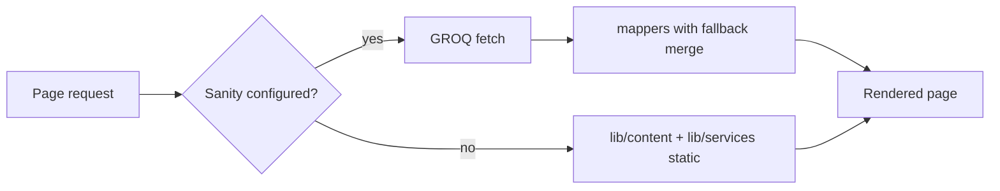

# G.2 — Post-seed verification & CMS source of truth

**Status:** production dataset seeded and verified (2026-06-01).  
**Prerequisite:** [G.1 seed](./part-0-sanity-prep.md) — `pnpm seed:sanity` after backup.

**For Inna:** edit content in **Sanity Studio** (`pnpm studio`). Changes on the live site apply after publish + cache revalidate (webhook when configured). Do **not** edit `lib/content/*.ts` or `lib/services/**` for day-to-day copy — those files are developer fallbacks only.

---

## 1. Source of truth (agreed policy)

| Layer | Role | When it wins on the site |
|-------|------|---------------------------|
| **Sanity (production dataset)** | **Primary** — texts, prices, flags, legal, hub, concerns | `NEXT_PUBLIC_SANITY_PROJECT_ID` set and document exists |
| **`lib/content/{en,uk,ru}.ts`** | Fallback landing copy | CMS off, fetch error, or empty field → mapper/static |
| **`lib/services/**`** | Fallback catalog tree + dev images | Same; categories merged if missing in CMS |
| **`messages/*.json`** | UI chrome only (cookie, a11y, locale switcher) | Always next-intl — not in Sanity yet |
| **`/public/**` images** | Dev defaults (hero, gallery, category cards until upload) | Used when CMS `serviceImage` / hero not set |

**UK/RU empty field in CMS** → English on site (`pick-locale-field`).  
**Procedures / subcategories** → EN in CMS by design until translated in Studio.

**Re-seed warning:** `pnpm seed:sanity` **overwrites** documents with fixed `_id`s (landing, settings, legal, catalog, hub, concerns). Use only after backup or for a fresh environment — not for routine edits.

---

## 2. What lives in Sanity after seed

| Document type | IDs / pattern | Locales |
|---------------|---------------|---------|
| `landingPage` | `landingPage-en`, `-uk`, `-ru` | document i18n |
| `siteSettings` | `siteSettings-en`, `-uk`, `-ru` | document i18n |
| `legalPage` | `legalPage-{privacy\|terms}-{en\|uk\|ru}` | ×6 |
| `serviceCategory` | `serviceCategory-{slug}` | field i18n (EN/UK/RU titles) |
| `serviceSubcategory` | `serviceSubcategory-{cat}-{sub}` | field i18n (EN filled) |
| `serviceProcedure` | `serviceProcedure-{cat}-{sub}-{proc}` | field i18n + `concerns[]` refs |
| `treatmentsHub` | `treatmentsHub` | singleton, field i18n |
| `treatmentConcern` | `treatmentConcern-{slug}` | field i18n (glow, texture, …) |

**Studio entry points:** Site (per locale) · Services → hub, concerns, categories, Browse by category.

---

## 3. Runtime flow (developers)

- Landing: `getLandingContent` → `fetchLandingPage` + `mapLandingPageSafe` + catalog merge.  
- Catalog: `resolveServicesCatalog` → `fetchServicesCatalog` + `mapServicesCatalogSafe`.  
- Treatments hub copy: `treatmentsHub` + `catalog.hubUi` (static strings for some labels until added to schema).

---

## 4. Smoke checklist (post-seed)

### A. Studio — documents exist

- [x] `landingPage-en` / `-uk` / `-ru` — sections filled (editor-verified)
- [x] `siteSettings` ×3
- [x] Legal privacy + terms ×3 locales
- [x] `treatmentsHub` — H1, intro, FAQ headings (EN/UK/RU tabs)
- [x] `treatmentConcern` ×6 — titles; optional hub images (fallback on site if empty)
- [x] Categories — `featuredOnHomepage` / `featuredInNav` / `shortTitle` where needed
- [x] Procedures — `concerns[]` populated from seed (editable)

### B. Site — EN

- [x] `/` — publish in Studio → webhook `/api/revalidate` → site updates (verified 2026-06-01)
- [x] `/treatments` — H1/subtitle from hub, category cards, concern cards (smoke 2026-06-11)
- [x] `/treatments?concern=glow` — recommended list from Sanity `concerns[]` refs (smoke 2026-06-11)
- [x] Nav dropdown — featured categories + `/treatments/{slug}` links (smoke 2026-06-11)
- [x] Homepage services — 4 featured categories from catalog flags (smoke 2026-06-11)
- [x] Phone in footer/contact = `siteSettings` (`tel:+353…`, smoke 2026-06-11)

### C. Site — UK / RU

- [x] Landing copy aligned (manual QA — editor)
- [x] `/uk/treatments`, `/ru/treatments` — hub loads with localized copy (smoke 2026-06-11; see [part-5](./part-5-uk-ru.md))
- [x] Breadcrumbs localized (UK: «Головна», smoke 2026-06-11)
- [x] Procedure names EN — **expected**

### D. Images (known gap — phase D.3)

| Asset | Source today | Edit in Studio |
|-------|----------------|----------------|
| Hero | `/public/hero.webp` | **No** (dev-only) |
| Gallery slider | `/public` | **No** (dev-only) |
| Category / concern hub cards | `/public/*.webp` or CMS if uploaded | Category `image`, concern `image` |
| Brand logos | CMS if uploaded, else `/public/logos` | `landingPage` → About → brand logos |
| Procedure detail image | Static in catalog / public | Procedure `image` when D.3 done |

**Note:** Text and prices from CMS; most treatment photos still come from static paths until uploads in Studio.

---

## 5. Quick “where do I edit?” (Inna)

| I want to change… | Studio location |
|-------------------|-----------------|
| Homepage texts, FAQ, reviews, form | Site → Landing pages → pick EN/UK/RU |
| Phone, email, address, socials | Site → Site settings → locale |
| Privacy / Terms | Site → Legal pages |
| Treatment hub title & FAQ headings | Services → Treatments hub page |
| Client concerns (goals) | Services → Treatment concerns |
| Category on homepage / menu | Services → Categories → flags + short title |
| Price or procedure copy | Services → Browse by category → Procedures |
| Which procedures match a concern | Procedure → Helps with concerns |

---

## 6. G.1 record

| Field | Value |
|-------|--------|
| Seed command | `pnpm seed:sanity` |
| Dataset | `production` |
| Seed run on prod | **Yes** (team, 2026-06-01) |
| Backup before seed | Confirm archive path in team notes |

---

## Related

- [part-0-sanity-prep.md](./part-0-sanity-prep.md) — backup & env  
- [part-5-uk-ru.md](./part-5-uk-ru.md) — locale smoke  
- [site-settings-merge.md](./site-settings-merge.md) — contact canonical  
- [lib/README.md](../../lib/README.md) — code layout & fallback  
- [sanity-client-admin-roadmap.md](../plans/sanity-client-admin-roadmap.md) — full roadmap  
